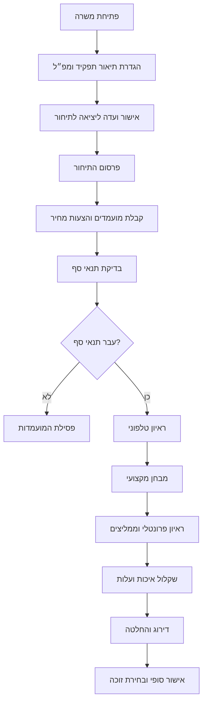
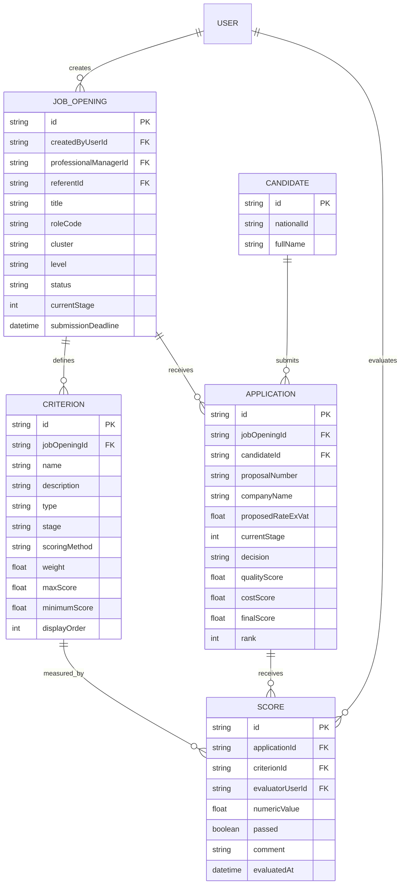
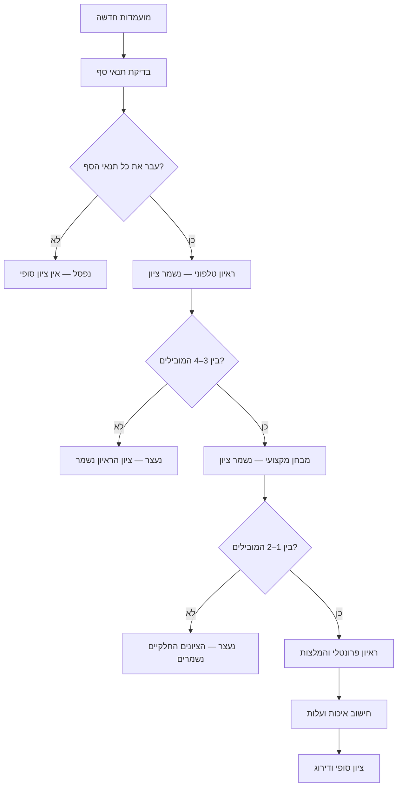

<p align="center">
  
</p>

<h1 align="center">NEXTHIRE</h1>

<p align="center">
  מערכת לניהול תהליך גיוס ותיחור — מפתיחת משרה ועד בחירת הזוכה
</p>

## תוכן עניינים

- [על הפרויקט](#על-הפרויקט)
- [מטרות המערכת](#מטרות-המערכת)
- [הטכנולוגיות](#הטכנולוגיות)
- [תהליך הגיוס](#תהליך-הגיוס)
- [ארכיטקטורת הנתונים](#ארכיטקטורת-הנתונים)
- [הישויות](#הישויות)
- [מפ״ל, קריטריונים וציונים](#מפל-קריטריונים-וציונים)
- [מעבר בין שלבי הסינון](#מעבר-בין-שלבי-הסינון)
- [חישוב הציונים](#חישוב-הציונים)
- [חלוקת העבודה](#חלוקת-העבודה)
- [החלטות פתוחות](#החלטות-פתוחות)
- [עבודה עם Git](#עבודה-עם-git)

## על הפרויקט

NEXTHIRE היא מערכת Full Stack שמדמה את תהליך הגיוס והתיחור של משרד ממשלתי.

כיום התהליך מנוהל באמצעות מכתבי Word וקובצי מפ״ל ב-Excel. מטרת המערכת היא להחליף את הקבצים המפוזרים בתהליך דיגיטלי אחד, מקושר וניתן למעקב.

המערכת מלווה משרה לאורך שישה שלבים:

1. הגדרת התפקיד, תנאי הסף והקריטריונים.
2. אישור ועדת מכרזים ליציאה לתיחור.
3. פרסום התיחור וקבלת הצעות.
4. סינון, ראיונות, מבחנים וניקוד מועמדים.
5. שקלול איכות ועלות ודירוג ההצעות.
6. אישור סופי ובחירת הזוכה.

## מטרות המערכת

- ריכוז כל המידע על משרה במקום אחד.
- הגדרת מפ״ל גמיש ושונה לכל משרה.
- בדיקה אחידה של כל המועמדים לפי אותם קריטריונים.
- שמירת תנאי סף, ציוני ביניים והערות המראיינים.
- מעקב אחרי השלב והסטטוס של כל מועמדות.
- חישוב ציוני איכות ועלות באופן עקבי ושקוף.
- דירוג המועמדויות ותיעוד ההחלטה הסופית.
- הפקת מסמכים ודוחות מתוך הנתונים במערכת.

## הטכנולוגיות

- **Frontend:** React + TypeScript
- **Backend:** Node.js + TypeScript
- **Database:** מסד נתונים יחסי, בהתאם להחלטת הארכיטקטורה
- **Version Control:** Git + GitHub
- **UI:** רכיבי Starter משותפים לכל הקבוצות

## תהליך הגיוס



## ארכיטקטורת הנתונים

המודל כולל ישות `USER` קיימת וחמש ישויות חדשות:

- `JOB_OPENING` — משרה ותהליך התיחור שלה.
- `CRITERION` — כלל בדיקה במפ״ל.
- `CANDIDATE` — אדם המועמד לתפקיד.
- `APPLICATION` — מועמדות של אדם למשרה מסוימת.
- `SCORE` — תוצאת בדיקת מועמדות לפי קריטריון.



## הישויות

### משתמש — `USER`

ישות קיימת במערכת. היא מייצגת רפרנטים, מנהלים מקצועיים, מראיינים וחברי ועדה.

המערכת משתמשת במזהה המשתמש כדי לדעת:

- מי פתח את המשרה.
- מי המנהל המקצועי והרפרנט.
- מי נתן כל ציון.

### משרה — `JOB_OPENING`

כל רשומה מייצגת משרה אחת ואת תהליך התיחור שלה.

מידע מרכזי:

- שם, קוד, אשכול ורמת התפקיד.
- יחידה מבקשת ותיאור הצורך.
- תיאור התפקיד והמשימות.
- מנהל מקצועי ורפרנט.
- תעריף מרבי, שעות חודשיות ומשך התקשרות.
- שלב נוכחי, סטטוס ומועד אחרון להגשה.

למשרה אחת יש קריטריונים רבים ומועמדויות רבות.

### קריטריון — `CRITERION`

כל רשומה מגדירה דבר אחד שבודקים אצל המועמדים.

דוגמאות:

- השכלה מתאימה.
- ארבע שנות ניסיון לפחות.
- ראיון טלפוני.
- מבחן מקצועי.
- המלצות.
- ראיון פרונטלי.
- עלות ההצעה.

התכונה `type` קובעת את סוג הקריטריון:

| סוג | משמעות | תוצאה |
| --- | --- | --- |
| `THRESHOLD` | תנאי סף שחייבים לעבור | עבר/לא עבר |
| `QUALITY` | קריטריון שמשפיע על ציון האיכות | ציון מספרי |
| `COST` | קריטריון המבוסס על המחיר | חישוב אוטומטי |

התכונה `stage` קובעת מתי הקריטריון נבדק, והתכונה `scoringMethod` קובעת כיצד מזינים את התוצאה.

### מועמד — `CANDIDATE`

כל רשומה מייצגת אדם אחד, ללא קשר למשרה מסוימת.

מידע בסיסי:

- מספר תעודת זהות.
- שם מלא.
- קישור לקורות חיים, אם נדרש.

לא שומרים כאן ציונים, שלב, החלטה או חברה, משום שאותו אדם יכול להשתתף בכמה תהליכי גיוס.

### מועמדות — `APPLICATION`

כל רשומה מחברת מועמד למשרה מסוימת ולחברה שהגישה אותו.

מידע מרכזי:

- מזהה המשרה והמועמד.
- מספר הצעת מחיר.
- שם החברה המגישה.
- תעריף מוצע ללא מע״מ.
- מועדי מבחן וראיון.
- השלב הנוכחי וההחלטה.
- ציוני איכות, עלות וציון סופי.
- דירוג והערות.

אותו מועמד יכול להשתתף בכמה משרות. הוא גם עלול להיות מוגש לאותה משרה על ידי יותר מחברה אחת; במקרה כזה המערכת מזהה את הכפילות ומסמנת אותה.

### ציון — `SCORE`

כל רשומה שומרת תוצאה של מועמדות אחת בקריטריון אחד.

- בתנאי סף נשמר `passed` — עבר/לא עבר.
- בקריטריון איכות נשמר `numericValue` — ציון מספרי.
- בקריטריון עלות הציון מחושב אוטומטית.
- `evaluatorUserId` מצביע למשתמש שנתן את הציון.

## מפ״ל, קריטריונים וציונים

המפ״ל אינו טבלה נפרדת במסד הנתונים. הוא מסך או דוח שמחבר מידע מכמה טבלאות:

| מידע במפ״ל | מקור הנתונים |
| --- | --- |
| פרטי התפקיד והליך התיחור | `JOB_OPENING` |
| שמות הקריטריונים והמשקולות | `CRITERION` |
| שם ותעודת זהות של מועמד | `CANDIDATE` |
| חברה, מחיר, שלב והחלטה | `APPLICATION` |
| עבר/לא עבר וציונים מספריים | `SCORE` |
| ציון כולל ודירוג | מחושבים עבור `APPLICATION` |

### ההבדל בין קריטריון לציון

קריטריון הוא ההגדרה:

> יכולת לוגית, ציון מרבי 5, משקל 20%.

ציון הוא התוצאה של מועמד מסוים:

> המועמדות של דני קיבלה 4 מתוך 5 ביכולת לוגית.

לכן קריטריון נוצר פעם אחת עבור המשרה, אבל נוצרות עבורו רשומות ציון רבות — אחת לכל מועמדות ולכל מעריך.

## מעבר בין שלבי הסינון

ציון ניתן ונשמר מיד לאחר כל שלב. הציון הסופי מחושב רק לאחר שהמועמד השלים את כל השלבים הנדרשים.



מועמד שנעצר לאחר ראיון טלפוני עדיין שומר את ציון הראיון שלו, אך לא נוצרים עבורו ציוני מבחן או ראיון פרונטלי. הציון הסופי שלו נשאר ריק — לא אפס.

## חישוב הציונים

תנאי סף אינם משתתפים בחישוב. הם רק קובעים אם המועמד רשאי להמשיך.

אם הקריטריון מקבל ציון מתוך 5:

```text
ציון מנורמל = (הציון שהתקבל / הציון המרבי) × 100
```

תרומת הקריטריון לציון הכולל:

```text
תרומה = ציון מנורמל × משקל הקריטריון
```

דוגמה:

| קריטריון | ציון | משקל | תרומה |
| --- | ---: | ---: | ---: |
| ראיון טלפוני | 80 | 20% | 16 |
| מבחן מקצועי | 90 | 20% | 18 |
| המלצות | 80 | 5% | 4 |
| ראיון פרונטלי | 85 | 35% | 29.75 |
| עלות | 90 | 20% | 18 |

```text
ציון סופי = 16 + 18 + 4 + 29.75 + 18 = 85.75
```

כללי ולידציה מומלצים:

- לתנאי סף אין משקל ואין ציון מספרי.
- לקריטריון איכות חייבים להיות ציון מרבי ומשקל.
- ציון עלות מחושב אוטומטית.
- סכום משקולות הקריטריונים הסופיים חייב להיות 100%.
- לא יוצרים ציון לשלב שהמועמד לא הגיע אליו.
- לא מחשבים ציון סופי למועמד שלא השלים את כל השלבים הנדרשים.

## מה אינו ישות נפרדת?

- **מפ״ל** — תצוגה המורכבת מקריטריונים, מועמדויות וציונים.
- **תיחור** — מיוצג באמצעות המשרה והמועמדויות שהוגשו אליה.
- **שלב** — נשמר כתכונה במשרה ובמועמדות.
- **החלטה** — נשמרת כתכונה במועמדות.
- **חברה** — בשלב הנוכחי נשמרת בשם החברה בתוך המועמדות.
- **דירוג** — מחושב מתוך הציונים.
- **מסמכים** — מנוהלים בתשתית המסמכים המשותפת.

## חלוקת העבודה

### קבוצה א׳ — שלבים 1–3

- פתיחת משרה.
- תיאור תפקיד.
- הגדרת המפ״ל והקריטריונים.
- הצגת הסטטוס הכללי של התהליך.

### קבוצה ב׳ — שלבים 4–6

- מועמדים ומועמדויות.
- תנאי סף וציונים.
- שקלול איכות ועלות.
- דירוג והחלטה סופית.

### קבוצה ג׳ — תשתית משותפת

- משתמשים והרשאות.
- יצירת מסמכים.
- רכיבים ותשתיות משותפות.

`APPLICATION` היא נקודת החיבור המרכזית בין קבוצה א׳ לקבוצה ב׳, ו-`USER` הוא שירות משותף של קבוצה ג׳.

## החלטות פתוחות

יש לאשר מול המנחה או המשרד:

1. מהי הנוסחה המדויקת לחישוב ציון העלות.
2. אילו משקולות הן הקובעות כאשר קיימת אי-אחידות בין קובצי המפ״ל.
3. כיצד מאחדים ציונים של כמה מראיינים — ממוצע, סכום או ציון מוסכם.
4. האם הראיון נשמר כציון כולל או מפורק לשאלות משנה.
5. האם דירוג המעבר מבוסס רק על מספר המובילים או גם על ציון מינימלי.
6. האם לשמור ערכים מחושבים במסד הנתונים או לחשב אותם בכל בקשה.

## עבודה עם Git

לכל משימה יש לפתוח ענף נפרד:

```bash
git checkout -b feature/job-opening-form
```

לאחר השלמת המשימה:

```bash
git add .
git commit -m "feat: add job opening form"
git push origin feature/job-opening-form
```

לאחר מכן פותחים Pull Request, מבצעים בדיקת קוד וממזגים ל-`main` רק לאחר אישור.

## קונספט הלוגו

הלוגו משלב:

- את האות `N` של NEXTHIRE.
- חץ קדימה המסמל את השלב הבא בקריירה.
- נקודות מחוברות המסמלות את שלבי תהליך הגיוס.
- כחול כהה המייצג מקצועיות ואמינות.
- טורקיז המייצג התקדמות, חדשנות וטכנולוגיה.

הלוגו נשמר בנתיב:

```text
assets/nexthire-logo.png
```
